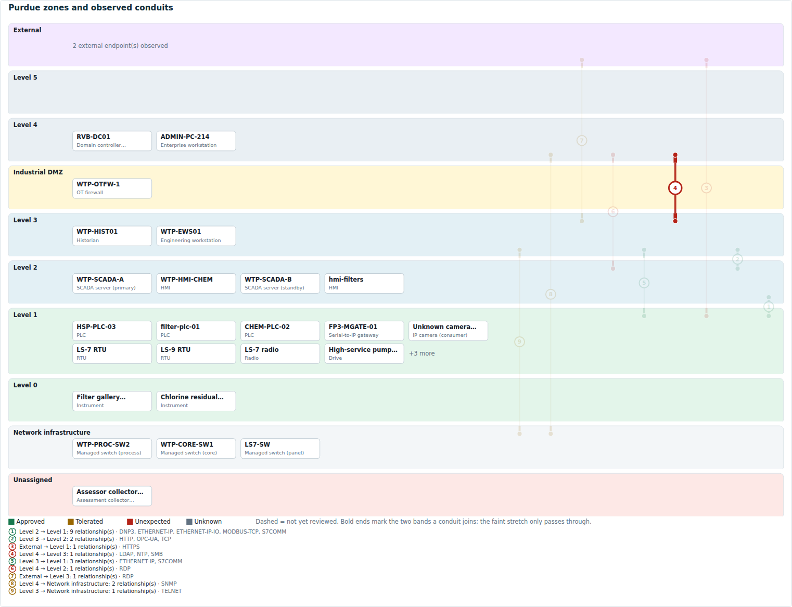
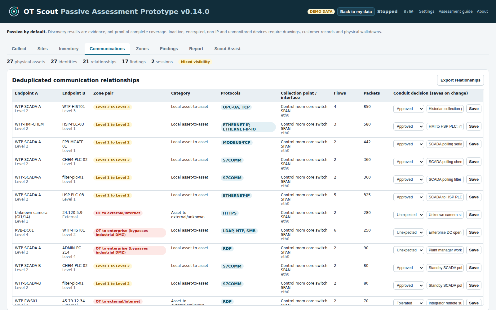
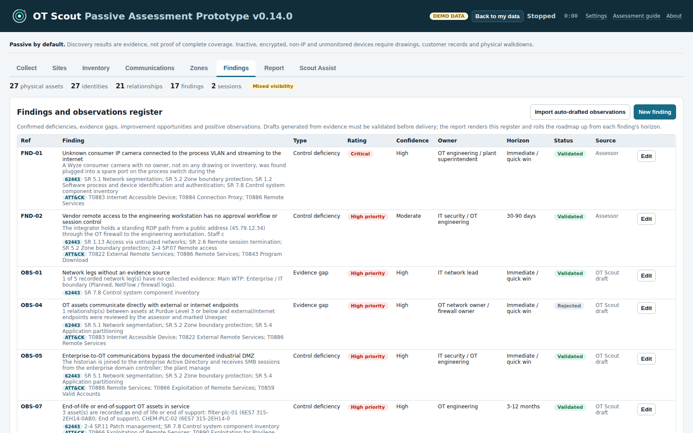
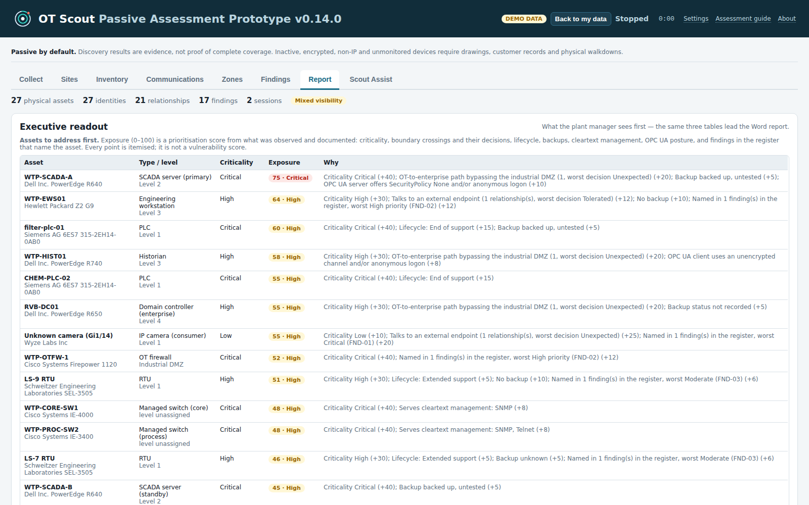
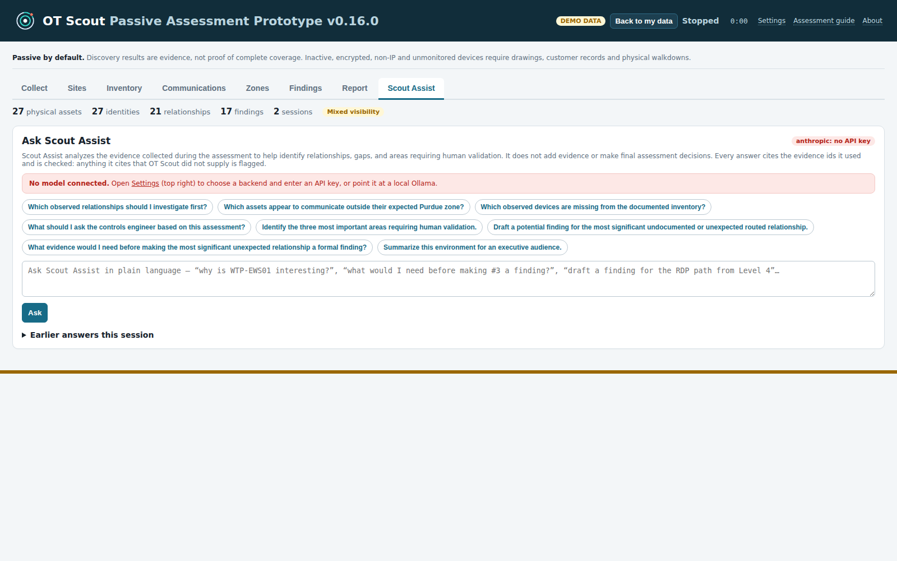
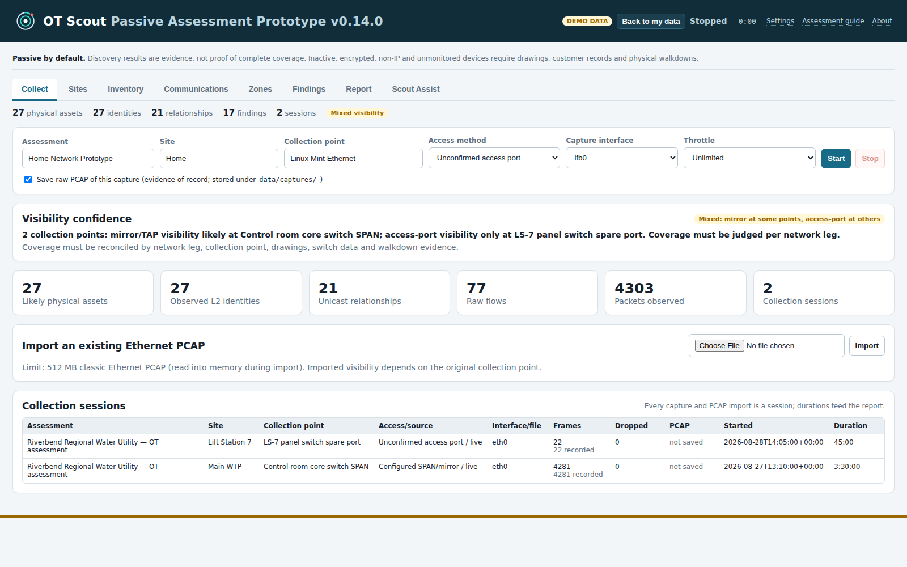

# OT Scout

A passive OT/ICS assessment tool: plug a laptop into a mirror port, capture what the plant network is already saying, and turn it into an asset inventory, a communications map, a Purdue zone/conduit diagram, a findings register and a Word report — without ever sending a packet onto that network.

It is an assessment aid for an authorized engagement, not a monitoring platform. Discovery results are evidence, not proof of complete coverage: inactive, encrypted, non-IP and unmonitored devices still need drawings, customer records and a physical walkdown. The tool is built around that limitation rather than hiding it.

## What it looks like

Every screen below is the built-in demo dataset — Riverbend Regional Water Utility, entirely fictitious, external endpoints in the RFC 5737 documentation range — which loads in the app with one click. GitHub renders them inline, so you can see the whole tool without cloning anything. The full set of tab screenshots is in [`docs/img/`](docs/img).

### Purdue zones and conduits



Every asset in its band; every conduit its own numbered line, bold where it lands and faint where it only passes through. The numbers match the zone-pair table. It is redrawn into the Word report as native Word shapes, and exports as SVG for anywhere else.

### Communications, collapsed to relationships



One row per device pair with every flow folded in, labelled by the Purdue boundary it crosses, with a conduit decision on each: Approved, Tolerated or Unexpected. Broadcast and service-discovery traffic is kept in a separate table on purpose.

### Findings register



Observations drafted from the evidence arrive with IEC 62443 and ATT&CK for ICS references pre-filled. Every one is a draft: the assessor validates it, rewrites it in plain language, sets rating and confidence, names an owner and a horizon — or rejects it. One finding per problem class, with links to every instance.

### Executive readout



Assets ranked by an itemised exposure score (a prioritisation score, not a vulnerability score), a fleet view by model, and the 62443 requirements the findings bear on. The same three tables lead the Word report.

### Scout Assist



A language model over the assessment's own evidence, answering in a fixed structure and checked against the evidence ids it was handed — anything it cites that OT Scout did not supply is flagged. It analyses evidence; it never becomes a source of it. Local or cloud backend, the assessor's choice.

### Collect



Where an engagement starts: pick the interface, name the site and collection point, start listening. Visibility confidence says what the access method can and cannot see, instead of pretending the capture was complete.

## Passive means passive

Capture opens a raw socket on the chosen interface in promiscuous mode and reads frames. There is no code path that transmits on it: no scanning, no probing, no queries to any device, no credentials for anything. Nothing on the OT network ever talks to the collection laptop — it only sees a copy of traffic from a SPAN/mirror port or a TAP. If all you have is an ordinary access port, the tool tells you so (Visibility confidence on the Collect tab) instead of pretending it saw everything.

Two things do leave the laptop, neither on the capture interface and neither on its own: **Update vendor database** fetches the IEEE OUI registry over HTTPS, and **Scout Assist pointed at a cloud model** sends the evidence selected for each question to that provider. Both are yours to decide — update the vendor table before you travel, use a local Scout Assist backend, and the machine stays silent. See [`INSTALL.md`](INSTALL.md).

Decoded passively: ARP, DHCP, DNS, LLDP, HTTP, Modbus/TCP device identification, EtherNet/IP (ListIdentity and explicit Identity-object reads), OPC UA (endpoints, application/product identity, security policies, authentication), BACnet I-Am, DNP3, Siemens S7comm, Profinet DCP, plus the usual IT protocols for context (RDP, SMB, LDAP, SNMP, Telnet…).

## Requirements

- Linux (tested on Linux Mint / Ubuntu). Raw packet capture needs root.
- Python 3.10+. **No third-party packages** — standard library only, including the .docx report writer.
- A SPAN/mirror port or a network TAP at each collection point, if you want more than broadcast traffic.

## Run it

```bash
git clone https://github.com/cvhyatt-code/ot-scout.git
cd ot-scout
python3 -m unittest discover -s tests   # 176 tests
sudo python3 run.py                     # http://127.0.0.1:8080
```

`--port` and `--database` do what they say. `--host` is different: the web interface has **no authentication**, so it binds to localhost and refuses any other address unless you also pass `--insecure-bind`. To reach a collector remotely, put a tunnel in front of it (`ssh -L 8080:localhost:8080 user@collector`, or `tailscale serve`) rather than opening the bind. See [`INSTALL.md`](INSTALL.md) for hardware, capture, remote access and getting the evidence off. Data lives in `data/ot_scout_v4.db` (SQLite) and is git-ignored.

To see the tool populated without a plant, open **Engagement** in the header and load the demonstration data — it builds a fictitious water utility (Riverbend Regional Water Utility) with mixed SPAN/access-port captures, decoded fingerprints, a walkdown inventory, Purdue placement, conduit decisions and findings. It lives in its own database, so your engagements are untouched; the same panel switches back.

## How an assessment flows through it

The tabs are in engagement order; the **Assessment guide** link in the header walks through them (also in `ASSESSMENT_GUIDE.md`).

1. **Collect** — name the assessment/site/collection point, choose the interface and access method, start capture. Import an existing PCAP if someone else captured. Optional throttle for a fragile SPAN or a weak laptop.
2. **Sites** — per-site validation checklist and the network legs / collection-point matrix; coverage per leg is computed from the sessions captured there.
3. **Inventory** — physical assets separated from raw L2 identities, with device type, manufacturer, fingerprints and evidence. Add *documented* assets the capture can't see (serial PLCs, RTUs, radios) singly or from the CSV template; lifecycle fields (EoL, support, backups) feed draft findings.
4. **Communications** — deduplicated relationships (one row per pair of identities, all flows folded in), with a conduit decision on each: Approved / Tolerated / Unexpected. Broadcast and service-discovery traffic is kept separate.
5. **Zones** — Purdue level per asset (suggested from protocol role, accepted or corrected by the assessor), a zone-pair rollup and a numbered band diagram; click a row to highlight its line. Drawn into the Word report, and exportable as SVG.
6. **Findings** — register of findings/observations with rating, confidence, owner, horizon and status. Auto-drafted observations from the evidence are imported as drafts and validated by hand.
7. **Report** — an executive readout (assets ranked by an itemised exposure score, fleet view by model, IEC 62443 requirements the findings bear on), a Word report (cover, executive readout, coverage, inventory, communications, zones, findings, roadmap, appendices), CSV/JSON/SVG exports and an evidence package with raw PCAPs and a SHA-256 manifest. `python3 -m ot_scout.report assessment.json report.docx` re-renders offline.

## Scout Assist

The **Scout Assist** tab (and `copilot.py` at the terminal) puts a language model on top of the assessment export. OT Scout stays the source of truth — the model is handed evidence records with stable ids (ASSET-007, REL-012, CAP-001, FND-02), must answer as structured JSON citing them, and every reply is checked for ids, IPs and MACs that were never supplied. Nothing in capture, parsing or the store is involved.

```bash
curl -fsSL https://ollama.com/install.sh | sh && ollama pull qwen2.5:7b   # once, on the analysis machine
python3 copilot.py --database data/demo.db                 # interactive, local model, offline
python3 copilot.py --database data/demo.db --eval          # the eight standard questions, logged
python3 copilot.py --database data/demo.db --dry-run --ask "Why is WTP-EWS01 interesting?"   # show the prompt, call nothing
python3 copilot.py --log-summary data/copilot-log.jsonl    # compare models: valid JSON, grounded, latency
```

In the app: Settings (top right) → choose the backend, paste the key (stored in `data/copilot-settings.json` on that machine, mode 0600, never in a database or evidence package), Save, Test connection. Then ask; each answer carries a grounding pill, and "Start a finding from this" hands the draft to the findings register for review. Backends: `anthropic`, `openai` (or any OpenAI-compatible URL), `ollama` and `llamacpp` (local — evidence stays on the box). A cloud backend receives the evidence selected for each question (names, IPs, MACs, relationships); use a local model when customer data may not leave site. `--budget` trims how much evidence is sent per question (default 12,000 characters, about 3,000 tokens) — lower it on a slow CPU.

## Layout

```
run.py                 start the web app
demo.py                build the demonstration database
copilot.py             assessment copilot CLI (local/cloud LLM over the evidence export)
ot_scout/
  capture.py           raw-socket capture, PCAP import, rate limiter
  parser.py            Ethernet/IP/industrial-protocol decoders and dispatch
  opcua.py             OPC UA binary-transport decoder
  cip.py               EtherNet/IP explicit messaging (CIP Identity object) decoder
  frameworks.py        IEC 62443 / ATT&CK for ICS catalogues and draft-finding mapping
  exposure.py          per-asset exposure score, fleet view, IEC 62443 rollup
  store.py             SQLite store, inventory/relationship/zone logic, SVG diagram
  report.py            analysis, draft findings, .docx generation (stdlib only)
  copilot.py           evidence ids, evidence selection, constrained prompt, grounding check, log
  llm_backends.py      Ollama / llama.cpp / OpenAI-compatible / Anthropic chat backends (urllib)
  copilot_service.py   copilot behind the web UI: saved model connection, one-at-a-time asks, history
  vendor.py            IEEE OUI lookup
  web.py               HTTP server and JSON API
  static/index.html    the single-page UI
tests/                 unittest suite
ASSESSMENT_GUIDE.md    step-by-step plan shown from the app's header
CHANGELOG.md           every version, shown from the app's About link
```

## Status

Actively developed, and maintained by one person alongside consulting work — see `CONTRIBUTING.md` for what that means in practice. Version is in `ot_scout/__init__.py` and shown in the header, browser tab, startup line and About dialog. See `CHANGELOG.md`.

## Issues, contributions and security

Bug reports and suggestions are welcome — open an issue. **Pull requests are not accepted**, so that
the copyright stays in one place and future licensing decisions stay open; fork it instead, which the
licence explicitly allows. See [`CONTRIBUTING.md`](CONTRIBUTING.md).

To report a vulnerability, use **Report a vulnerability** on the Security tab rather than a public
issue. Scope and what to expect are in [`SECURITY.md`](SECURITY.md).

## License

Copyright (C) 2026 Higate Ventures LLC.

OT Scout is free software: you can redistribute it and/or modify it under the terms of the **GNU Affero General Public License, version 3 or later**, as published by the Free Software Foundation. The full text is in [`LICENSE`](LICENSE).

In plain terms: use it, change it, run it on client engagements, charge for the work you do with it. If you distribute a modified version — or let other people reach a modified version over a network — you have to make your source available under the same license. It stays open.

It is distributed WITHOUT ANY WARRANTY, express or implied, including any warranty of merchantability or fitness for a particular purpose. See sections 15 and 16 of the license.

OT Scout has no third-party code dependencies. Attributions for the reference data and framework identifiers it does reproduce — MITRE ATT&CK for ICS, IEC 62443 and the IEEE OUI registry — are in [`NOTICE`](NOTICE).

**Use it only where you are authorized to.** OT Scout never transmits on the interface it captures from, but capturing traffic on a plant network is still an activity that needs the asset owner's permission and, in most environments, a change record. You are responsible for having it. "OT Scout" and "Higate Ventures" are not licensed as trademarks.
